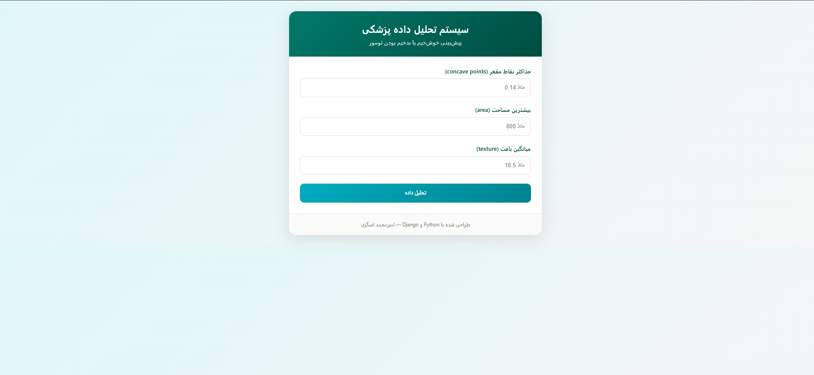

# Breast Cancer Ruleset Classifier

یک دموی تعاملی از مدل‌های قاعده‌محور **تشخیص سرطان پستان** بر اساس مجموعه داده‌ی معروف Wisconsin.

> 💡 طراحی شده برای نمایش **تحلیل داده‌های پزشکی** در پورتفولیوی شخصی  بدون نیاز به مدل‌های سنگین یادگیری ماشین.

---

## 🎯 ویژگی‌ها

- پیش‌بینی خوش‌خیم / بدخیم بودن تومور با **۳ ویژگی کلیدی**
- مبتنی بر **Ruleset 6** با دقت ۹۷٪
- رابط کاربری **تمیز، پزشکی و بدون پیچیدگی**
- بدون JavaScript فریم‌ورک  فقط HTML, CSS, JS ساده
- مناسب برای جاسازی در پروژه‌های Django / Flask

---

## 🚀 نحوه استفاده

فقط فایل `index.html` رو در مرورگر باز کنید!

- ورودی‌ها:
  - `worst concave points`
  - `worst area`
  - `mean texture`
- خروجی:
  - **خوش‌خیم (1)** یا **بدخیم (0)**

---

## 📊 پشتوانه علمی

قوانین از مدل **RuleFit / RIPPER** روی **Breast Cancer Wisconsin Dataset** استخراج شده‌اند.

- دقت مدل: **97%**
- تعداد قوانین: **5**

---

## 👨‍💻 ساخته شده توسط

**امیرمحمد عسگری**  
Python Developer | Medical Data Analyst  
[GitHub](https://github.com/mr-amirasgari) • [LinkedIn](https://www.linkedin.com/in/amirmohammadasgari)

---

> 🔒 این دمو فقط جهت نمایش مفهومی است. برای استفاده‌ی بالینی، همیشه با یک متخصص پزشکی مشورت کنید.

